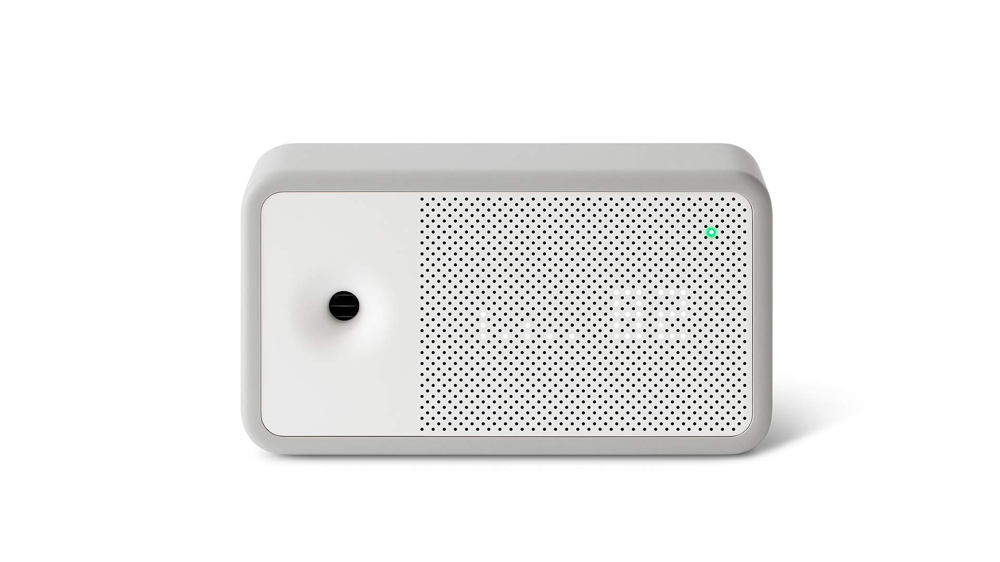
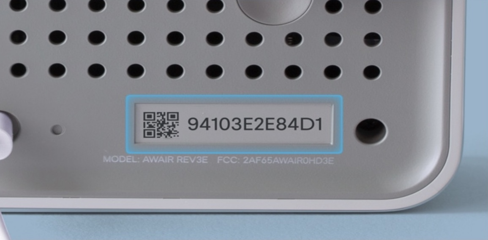
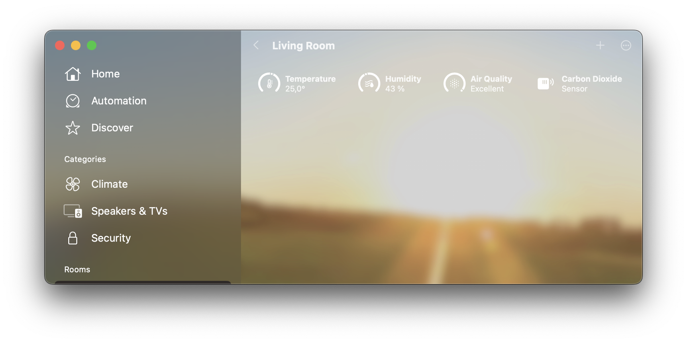

# HomeSpanAwairSensor
Very basic HomeKit bridge for [Awair Element](https://www.getawair.com/products/element) Indoor Air Monitor.


## About
Uses an ESP32 based microcontroller to listen to the sensor data sent from a Awair Element and relays them out as HomeKit HAP Notifications. No internet connection required and everything stays local.

## Directions
### 1). Install with Arduino IDE
1. Open the Arduino sketch __```HomeSpanAwairSensor.ino```__ in the Arduino IDE
2. Install both the [HomeSpan](https://github.com/HomeSpan/HomeSpan) and [Arduino_JSON](https://github.com/arduino-libraries/Arduino_JSON) libraries
    
    __*Sketch > Include Libraries > Manage Libraries*__
3. Follow the directions [here](https://github.com/espressif/arduino-esp32/blob/master/docs/arduino-ide/boards_manager.md) to install the various ESP32 boards or install whatever is relevant to your specific board and select the board you are using from
    
    __*Tools > Board > ESP32 Arduino > Your Board*__
4. Upload the sketch to the board with __*Sketch > Upload*__ or click the little arrow pointing right in the top left corner of the window

### 2). Configuring the device for HomeKit
1. [Turn on the sensor Local API Feature](https://support.getawair.com/hc/en-us/articles/360049221014-Awair-Element-Local-API-Feature)
2. Change the following parameters in sketch with yours:
```C++
const char* ssid        = "My Wi-Fi SSID";      // Wi-Fi SSID
const char* password    = "My Wi-Fi Password";  // Wi-Fi Password
const char* pairingCode = "12341234";           // Pairing Code. Not Allowed: 00000000, 11111111, 22222222, 33333333, 44444444, 55555555, 66666666, 77777777, 88888888, 99999999, 12345678, 87654321
String serialNumber     = "70886B......";       // Sensor Serial Number
```
You can find the serial number in on the back of your device:


### 3). Connect to HomeKit
Add the device like you would any other accessory by typing your pairing code from parameters above. By default pairing code is ```1234-1234```

## Usage
If you're connected to HomeKit, you should be able to see the sensors.


## Dependencies
Uses the wonderful [HomeSpan](https://github.com/HomeSpan/HomeSpan) library for HomeKit functionality and [Arduino_JSON](https://github.com/arduino-libraries/Arduino_JSON) for parsing the sensor data.
